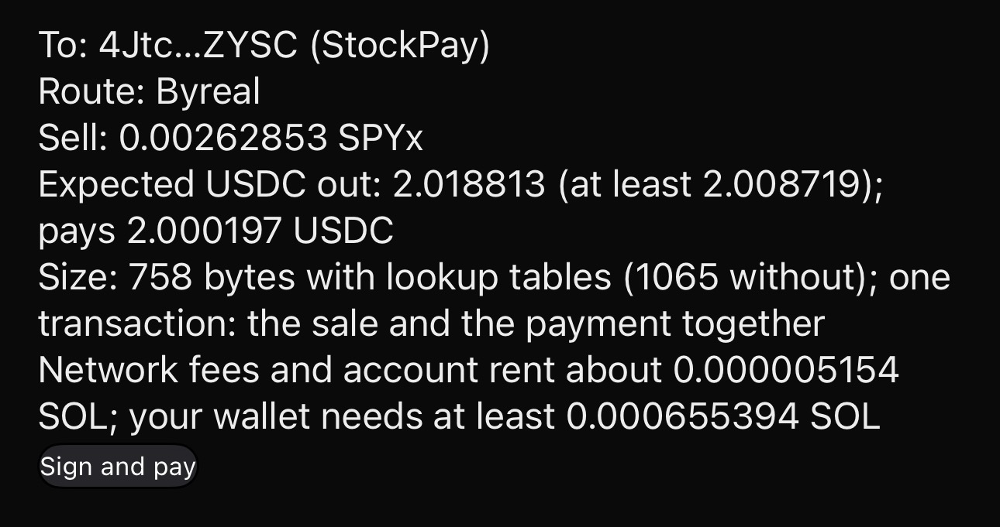
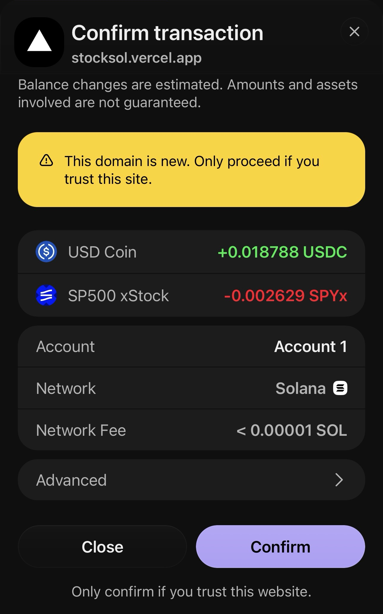
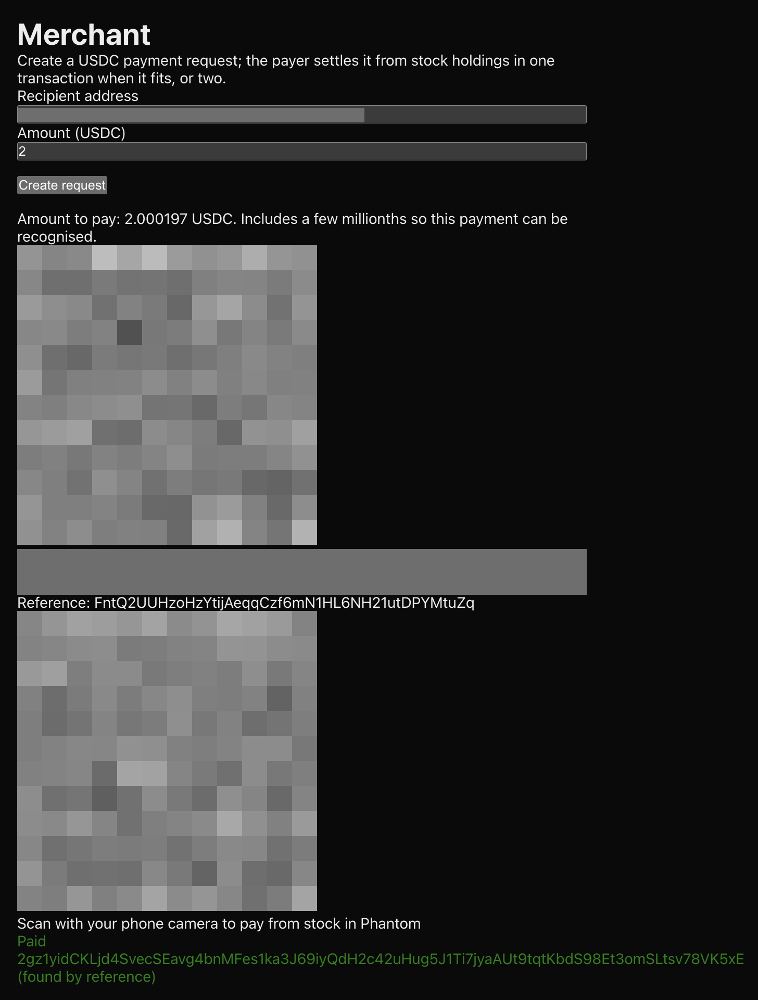

# StockPay

**Pay from tokenized stocks. Get paid in USDC.**

StockPay pays a Solana Pay USDC request, or sends USDC to any Solana wallet address, straight from tokenized stocks you hold. You approve once: when the route fits, one non-custodial Solana transaction sells just enough of your holding through Jupiter, pays the exact USDC amount, and leaves the change in your wallet. The person you pay only ever receives USDC.

> **Status:** open-source prototype built for the Stocklana hackathon. Not offered as a service and not registered with any regulator. StockPay never holds funds or keys. Payments of any kind are switched off on the [public site](https://stocksol.vercel.app); the payment log below links real mainnet payments we made. Not financial advice.

## Payment log

Eight real payments on Solana mainnet, all on 24 Sep 2026 (UTC). Five were paid from SPYx through StockPay; three are plain USDC payments from wallet apps that the merchant page found and marked Paid.

| # | What happened | Amount | Transaction |
|---|---|---|---|
| 1 | Paid from SPYx through StockPay; merchant page showed Paid, found by reference | 2.000197 USDC | [2gz1yi...K5xE](https://explorer.solana.com/tx/2gz1yidCKLjd4SvecSEavg4bnMFes1ka3J69iyQdH2c42uHug5J1Ti7jyaAUt9tqtKbdS98Et3omSLtsv78VK5xE) |
| 2 | Paid from SPYx through StockPay; our verifier passed it | 3.000102 USDC | [355dqy...H1XM](https://explorer.solana.com/tx/355dqybTpG2Fv3tBnJyqqSfCm4PZ8muDtjqDERRuXJLy8fFpvooAZDQs6AA7dTWPY1sgNYyGXtg4AfWzAn89H1XM) |
| 3 | Paid from SPYx through StockPay, on a route across several pools (see Limits) | 3.000699 USDC | [sN6Dyx...G1aQ](https://explorer.solana.com/tx/sN6Dyx4tGDcpymweAqT5h7C8HKaxMiyoLUCVHERDU58DvuRe3y7AWLcFaEDH6b1QBu7bsPqMzUE6fx7FnghG1aQ) |
| 4 | Paid from SPYx through StockPay; our verifier passed it | 2.000442 USDC | [4hJ6qk...Ayb1](https://explorer.solana.com/tx/4hJ6qkUgnaH15dVQZAdMKxgksqrQ3Q8wRpsQJMm4CVHr6NGhibMn2RpxW9VtKM7EtLHfDXUP8r4dAkyMBMCLAyb1) |
| 5 | Plain USDC payment from Solflare, from the request's QR; merchant page found it by reference | 2.50013 USDC | [4212Wz...Ucmx](https://explorer.solana.com/tx/4212WzNsmvCoL3NTTvB9QwXNh12JTHe4PPFp9oHhonF4udfYm379ygUVP2ijHXxexnX59PkWMgFBXdhjnaxSUcmx) |
| 6 | Paid from SPYx through StockPay to a wallet address, after the US market close; our verifier passed it | 1.000000 USDC | [5zrBTd...yeuF](https://explorer.solana.com/tx/5zrBTdnnSs9EdQG98s1j5chAxbgkk8MicXoKK7qCC1JmxaSANAPPRCaUQ3bXBq52nAgodJ1Db2iDaXwBkoj1yeuF) |
| 7 | Plain USDC send from Phantom's Send screen, recipient typed in; merchant page found it by exact amount | 1.000771 USDC | [ob1vfD...yaFW](https://explorer.solana.com/tx/ob1vfDZ5ewAjZC6NjPVY3AcHYbjujPZapz5qM8pcggvS1DzGjPWsD3Y2wjfKrLfK38YmE256AibHMWuTwTByaFW) |
| 8 | Plain USDC payment from Solflare after the phone camera read the request's QR; merchant page found it by reference | 2.000613 USDC | [5KgNRT...g3nG](https://explorer.solana.com/tx/5KgNRT9jds1zm9xkqxUpEYTxPPEfmoxX39ccTXJfcHuxHQ1C49ZMH1Cv4UbS3oRBBWK6Bm59q5nyxhPtoynMg3nG) |

**How to read it:** open payment 1. The Jupiter swap that sells SPYx and the USDC transfer to the payee sit in the same transaction, and the transfer carries the request's reference key; the only instructions after it are Lighthouse assertions that Phantom added (see What we found). The sale and the payment happen together or not at all.

| Quote on the pay page | Approval in Phantom | Merchant page |
|---|---|---|
|  |  |  |

Payment 1, from quote to Paid. The merchant screenshot hides both QR codes, the request link and the recipient address, because a wallet would still pay that request.

## How it works

```
Payer's wallet                StockPay                     Solana
     |   scan or paste request   |                            |
     |-------------------------->|  validate, quote (Jupiter), |
     |                           |  build and simulate         |
     |<--------------------------|  one transaction            |
     |  page checks the transaction before you sign            |
     |  approve once                                           |
     |--------------------------------------------------------->|
     |   [compute budget] [Jupiter: sell just enough SPYx]      |
     |   [create payee USDC account if needed]                  |
     |   [exact USDC transfer to payee, with reference]  (last) |
     |                                                          |
Merchant page  <------ finds the payment by reference or exact amount, verifies it
```

- **One transaction when it fits.** Versioned transactions with address lookup tables keep the sale and the payment under Solana's 1,232-byte limit. One real build came to 1,013 bytes with lookup tables and 1,996 without. Payment 6 was built at 850 bytes; without lookup tables it would have been 1,247, over the limit. A route too large for one transaction is split into two, signed together; two transactions are not all-or-nothing, so if the payment fails after the sale lands, the payee is not paid and the USDC stays in your wallet.
- **Exact amount, change stays with you.** The sale is sized so the route's minimum output after slippage covers the payment; anything above the payment stays in your wallet.

## Checks before you sign

The page decodes every transaction and refuses to ask for a signature unless:

- the last instruction is the exact USDC transfer to the payee, with the reference attached read-only;
- only the expected programs appear at the top level, and the only direct token instruction is that final transfer;
- a simulation shows your SPYx falls by no more than quoted, the sale brings in at least the route's minimum output, your SOL moves only by the quoted cost, and none of your token accounts gains a new delegate, owner or close authority;
- the request is not already paid, by its reference or by an exact-amount payment from your wallet in the last 24 hours.

After you sign, it checks what the wallet returned and simulates it again before sending.

## What we found

- **Phantom's own send dropped the Solana Pay reference.** Paying a StockPay QR with Phantom's built-in send delivered the right token and amount but omitted the reference ([transaction](https://explorer.solana.com/tx/5WjNgNHKDHvCAwBnr3qS8y2B7APgA4XARVnBQkTmGHo1Wej8gLULjB34rfV9KCki7bESwjj9GabK9zCZqmQrjFmK)), so a merchant watching the reference never sees it. Solflare's send kept the reference (payments 5 and 8). StockPay requests now add a few millionths of a USDC, and the merchant page also matches the exact amount arriving in its USDC account (payment 7).
- **Wallets pay requests that are already paid.** The wallets we tested don't check whether a Solana Pay request is already paid. After the merchant page showed Paid for payment 7, the same request was paid twice more with plain USDC sends ([urUSvd...12u4](https://explorer.solana.com/tx/urUSvdc3gd4xucKziLCmvwEUcW2ZF2NNvuhGRrY7H67GUMPHAsq2hJRavPf4qZQAw69P7p85WPxiihvep4112u4), [57RUby...UsRu](https://explorer.solana.com/tx/57RUbyKjQh4NkLpFLEH4WhaG3PYg2wxgWrodYF43uEZg9tfhRbLHU325PvWXbdmVbBWoFqYHm6sZD4LVtp2uUsRu)), and both went through. StockPay's pay page refused that link as already paid, and the merchant page now hides the QR once a request is paid.
- **Phantom changes the transaction you sign.** Phantom returned our transaction with Lighthouse assertion instructions added after our transfer (three on payments 4 and 6, four on payment 3), which our original check refused. Payment 1 grew from the 758 bytes we built to 882 as it landed. Phantom documents that it may add Lighthouse assertions. The pay page now allows only Lighthouse assertions after the transfer, and simulates the returned transaction again before sending.
- **SPYx amounts differ between screens.** SPYx carries a scaled-UI multiplier, and screens disagree on applying it, even within one app: Phantom's approval screen applies it and its token list doesn't, a difference of about 0.57% when we paid. Solana Explorer, Solscan's transaction summary and our page apply it. Solscan and Phantom's history also describe these payments as Jupiter swaps.
- **The standard verifier could not read these transactions.** The Solana Pay library's `validateTransfer` could not verify versioned transactions with lookup tables in the versions we checked (0.2.6 and 1.0.26), so StockPay verifies payments with its own verifier.

## Why not just swap, then send?

In Phantom that is two approvals, you work out the amount yourself, and Phantom charges a 0.85% swap fee on most swaps. StockPay is one approval, the payee receives the exact amount, and the Jupiter route type it uses charges no Jupiter fee. Pool fees and network fees still apply.

## Why Solana

- **The stock is already here.** Tokenized stocks trade on Solana around the clock (Solana said on X in September 2026 that 63% of tokenized-equity volume on Solana was outside traditional market hours as of August 2026).
- **Sale and payment fit in one transaction**, thanks to versioned transactions with lookup tables.
- **The merchant needs no server.** Solana validators index transactions by the accounts they touch, so the reference lets the merchant page find and verify its payment straight from the chain, with no database and no custody.

## Limits

- One holding in this version: SPYx (xStocks). Paying from stock is tested with Phantom mobile only. Payments below 25 USDC.
- Solana Pay USDC transfer requests only (no SOL requests, memos or transaction requests).
- A route through several pools can leave an empty account for an intermediate token in your wallet, as payment 3 did; the wallet can close it to reclaim its rent.
- While a Solana Pay link is loaded, the pay page ignores the typed recipient and amount rather than hiding those fields.
- Wallets can pay a request that is already paid (see What we found).
- No outside users yet.

## Run it yourself

Tested with Node.js 22 and pnpm 11. Mainnet only: payments move real funds.

```sh
pnpm install
pnpm dev
pnpm test
```

Server-side environment variables, never exposed to the browser: `JUPITER_API_KEY`, `HELIUS_RPC_URL`.

Payments are switched off by default. To run both flows locally, set `PAY_ENABLED` to `true` in `src/lib/site.ts`. Pay from a different wallet than the one receiving: a payment to yourself moves USDC out of and back into one account, so the verifier, which checks that the payee's USDC balance rose by at least the amount, fails it.

Automated tests: 144 passing (`pnpm test`).

## Security notes

- Non-custodial: every transaction is signed in your own wallet.
- API keys stay on the server. The browser reaches Solana only through `/api/rpc`, which forwards an allowlist of RPC methods and caps request size.
- Payments are verified by StockPay's own verifier, not by trusting the wallet or the page.
- Inputs are validated on the server: wallet addresses, amounts (up to 6 decimals, capped), references.
- Pages cannot be framed by other sites.
- The SPYx issuer retains controls over the token, including a permanent delegate, pause and a transfer-hook authority; StockPay cannot override them.

## Eligibility

xStocks are not offered to US persons, and wallets restrict other regions. Use StockPay only where it is lawful for you to do so. Not financial advice.

## What's next

- Use your USDC first, selling stock only for the shortfall.
- An open-source pay-from-holdings library that wallets can build in.
- An agent payer that settles requests from a holding within set limits.

## Open source

MIT licensed. Built with Next.js, `@solana/web3.js`, `@solana/spl-token`, the Solana wallet adapter, `@solana/pay` (request links only) and `qrcode`, on the Jupiter Swap and Tokens APIs and Helius RPC.
